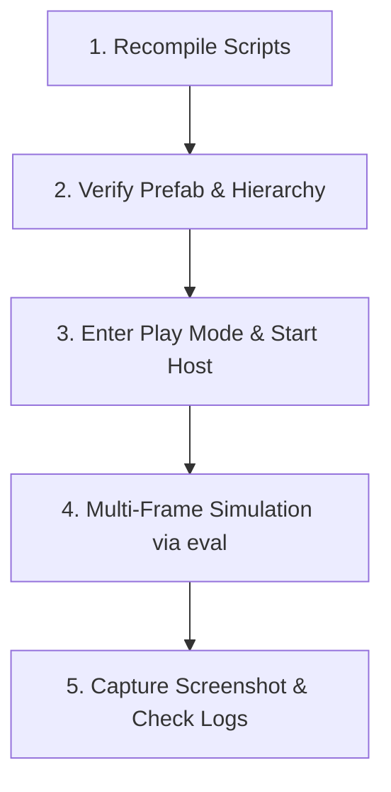

# Unity Playtest & Verification Protocol (Mandatory Workflow)

Whenever making changes to gameplay, network code (NGO), character models, procedural animation, physics, or scene assets:
**Run live Play Mode tests or automated verification before concluding the task.**

> For active test runners and system invariants, see [`AutomatedPlaytestVerifier.cs`](../../My%20project/Assets/Scripts/Editor/AutomatedPlaytestVerifier.cs) and [.agents/context_handoff.md](../../context_handoff.md).

---

## Standard 5-Step Verification Protocol



---

### Step 1: Recompile Scripts & Verify Domain Reload
Always trigger a recompile and verify zero compilation errors:

```bash
# Unity CLI
unity command recompile
unity command editor_status
```

Or via MCP `eval` / `recompile`.

---

### Step 2: Verify Prefab & Hierarchy State
Ensure that serialized fields, component additions, and visual offsets are saved in `.prefab` or scene assets cleanly:

```csharp
var prefab = UnityEditor.AssetDatabase.LoadAssetAtPath<GameObject>("Assets/Prefabs/Player/Player.prefab");
// Inspect CharacterController, procedural components, bone offsets
```

---

### Step 3: Enter Play Mode & Start Netcode Host
Never test Netcode / CharacterController in static Edit Mode alone. Start live Play Mode:

```bash
# Unity CLI
unity command editor_play
```

In `eval`, spawn or host the session:
```csharp
if (Unity.Netcode.NetworkManager.Singleton != null && !Unity.Netcode.NetworkManager.Singleton.IsListening) {
    Unity.Netcode.NetworkManager.Singleton.StartHost();
}
```

---

### Step 4: Multi-Frame Physics & Gameplay Simulation (`eval`)
Simulate user actions over consecutive frames to inspect velocities, transforms, bone IK, and physics states:

```csharp
var player = UnityEngine.Object.FindAnyObjectByType<CoopGame.Player.NetworkPlayer>();
var movement = player.GetComponent<CoopGame.Player.PlayerMovement>();

// Simulate WASD movement across 10-30 frames
for (int i = 0; i < 20; i++) {
    movement.ProcessMovement(new Vector2(0f, 1f), Vector3.forward, Vector3.right, false, false);
}
// Inspect bone positions, CharacterController.isGrounded, speed, and visual scales
```

**Key Invariants to Check:**
1. **Grounding**: Ensure feet (`Toe.L_end`, `Toe.R_end`) align with `capsuleBottom` (gap < 2mm).
2. **No Mesh Stretching**: Ensure `CharacterVisual.localScale` remains fixed and bone roots are not translating independently of sibling joints.
3. **Climbing & Reach Clamp**: Ensure hand visual targets are clamped to physical arm reach (`Vector3.ClampMagnitude`).
4. **No Drift on Shift**: Ensure `movedDuringShift == 0` while climbing.

---

### Step 5: Capture Visual Screenshot & Review Logs
Capture the live Game View to visually confirm model fidelity and check for runtime warnings/exceptions:

```bash
# Capture Game View
unity command capture_game_view

# Review console logs for errors
unity command get_console_logs
```

---

## Guardrails
1. **No Premature Git Commits**: Never commit or push unless explicitly requested by the user.
2. **Always Exit Play Mode Cleanly**: Stop Play Mode after testing (`editor_stop`) so the scene remains clean in the Editor.
3. **Clean Up Clones**: Ensure spawned clones are never accidentally saved into `.unity` scene files.
